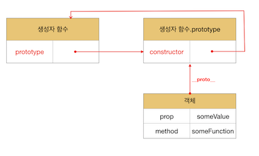
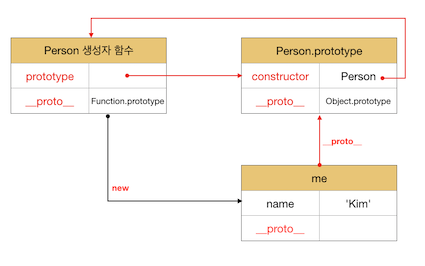
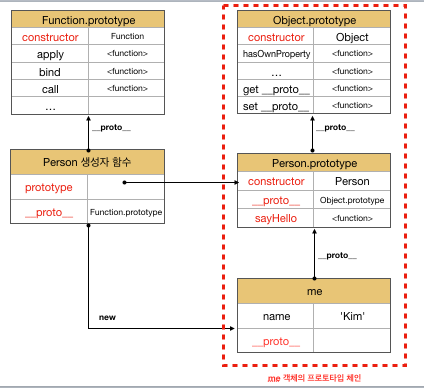

# 프로토타입
## 프로토타입 객체란?
객체 간 상속을 구현하기 위해 사용된다.  
프로토타입은 어떤 객체의 상위 객체의 역할을 하는 객체로서 다른 객체에 공유 프로퍼티(메서드 포함)을 제공한다.  
프로토타입을 상속받은 하위 객체는 상위 객체의 프로퍼티를 자신의 프로퍼티처럼 자유롭게 사용할 수 있다.

모든 객체는 [[Prototype]] 내부 슬롯을 가지며 `객체 생성 방식에 의해 내부 값이 결정`된다.
* 객체 리터럴에 의해 생성된 객체의 프로토타입은 Object.prototype
* 생성자 함수에 의해 생성된 객체의 프로토타입은 생성자 함수의 prototype 프로퍼티에 바인딩되어 있는 객체다.


> [[Prototype]] 내부 슬롯에는 직접 접근할 수 없지만 `__proto__` 접근자 프로퍼티를 통해 자신의 프로토타입에 간접적으로 접근할 수 있다.

## `__proto__` 란?

* __proto__는 접근자 프로퍼티로써 [[Prototype]] 내부 슬롯의 값 즉 `프로토타입에 접근할 수 있다`.
* Object.protoype의 프로퍼티다. 모든 객체는 상속을 통해 Object.prototype.__proto__를 사용할 수 있다.
  * 프로토타입 체인의 최상위 객체는 Object.prototype이다.
* 상호 참조에 의해 프로토타입 체인이 생성되는 것을 방지한다.
  * 프로퍼티 검색 방향이 한쪽 방향으로만 흘러가야 한다.
* 직접 사용하지 말고 `Object.getPrototypeOf`, `Object.setPrototypeOf`를 사용한다.
  * 직접 상속을 통해 Object.prototype을 상속받지 않을 수 있기 때문이다.

> 접근자 프로퍼티는 자체적으로 값[[Value]] 프로퍼티를 갖지 않고 다른 데이터 프로퍼티의 값을 읽거나 저장할 때 사용하는 [[Get]], [[Set]] 프로퍼티 어트리뷰트로 구성된 프로퍼티다.

<br>

```js
const parent = {};
const child = {};

child.__proto__ = parent;

parent.__proto__ = child; // TypeError: Cyclic __proto__ value
```

`Object.prototype.__proto__접근자 프로퍼티와 함수 객체만이 가지고 있는 prototype 프로퍼티는 결국 동일한 프로토타입을 가리킨다.`
하지만 이들 프로퍼티를 사용하는 주체가 다르다.

|구분|소유|값|사용 주체|사용목적
|:---:|:---:|:---:|:---:|:---:|
|`__proto__`| 모든 객체 | 프로토타입 참조 | `모든객체` | 객체가 자신의 프로토타입 접근 또는 교체하기 위해 사용 |
|prototype 프로퍼티| Constructor | 프로토타입의 참조 | `생성자 함수` | `생성자 함수가 자신이 생성할 객체(인스턴스)의 프로토타입을 할당`하기 위해 사용 |
<br>
> 화살표 함수와 ES6 메서드 축약 표현은 non-constructor이다.

<br>

```js
function Person(name) {
  this.name = name;
}

// 이때 constructor 연결이 이루어진다.
const me = new Person('Kim');

// 둘은 같은 값을 가진다.
console.log(me.__proto__ === Person.prototype); // true
```
<br>



`constructor 연결은 생성자 함수가 생성될 때` 이루어 진다.  
me 객체 자체에 constructor값은 없지만 Person.prototype에 constructor를 사용한다.


## Prototype 생성 시점

* `생성자 함수로서 호출할 수 있는 함수. 즉 Constructor는 함수 정의가 평가되어 함수 객체를 생성하는 시점에 Prototype도 생성된다. `(런타임 이전)
  * Prototype과 생성자 함수는 언제나 쌍으로 존재한다.

<br>

```js
// 함수 정의(constructor)가 평가되어 함수 객체를 생성하는 시점에 Prototype도 생성.
console.log(Person.prototype); // Person {}

function Person(name) {
  this.name = name;
}
```
<br>

```js
// 함수 표현식은 호이스팅안된다.
// console.log(Person.prototype); // ReferenceError: Person is not defined

// 화살표 함수는 non-constructor이다.
const Person = name => {
  this.name = name;
};

console.log(Person.prototype); // undefined

```

## Prototype Chain

* Prototype Chain이란? `프로퍼티(메서드 포함)에 접근하려고 할 때 해당 객체에 접근하려는 프로퍼티가 없다면 [[Prototype]] 상위 프로토타입의 프로퍼티를 순차적으로 검색한다.`
* `상속과 프로퍼티 검색을 위한 메커니즘`이다.
  * `Scope Chain은 식별자 검색을 위한 메커니즘`이다.
* Scope Chain과 Prototype Chain은 `서로 협력하여 식별자와 프로퍼티를 검색하는데 사용`된다.

```js
function Person(name) {
  this.name = name;
}

Person.prototype.sayHello = function () {
  console.log(`Hi! My name is ${this.name}`);
}

const me = new Person('Kim');

console.log(me.hasOwnProperty('name')); // true
```




```js
// hasOwnProperty는 Object.prototype의 메서드다.
// me 객체는 Prototype Chain을 따라 hasOwnProperty 메서드를 검색하여 사용한다.

me.hasOwnProperty('name') // true

// Object.prototype.hasOwnProperty.call(me, 'name');
// 자바스크립트 엔진은 Object.prototype.hasOwnProperty를 호출한다. 
// 이때 Object.prototype.hasOwnProperty 메서드의 this에는 me 객체가 바인딩된다.
```

> Object.prototype을 Prototype chain의 종점이라고 한다.

<br>

## 오버라이딩

* 상위 클래스가 가지고 있는 메서드를 `하위 크래스가 재정의하여 사용`하는 방식이다.

## 오버로딩

* 함수의 이름은 동일하지만 매개변수의 타입 또는 개수가 다른 메서드를 구현하고 매개변수에 의해 메서드를 구별하여 호출하는 방식이다.

## instanceof 연산자

* `우변의 생성자 함수의 prototype에 바인딩된 객체가 좌변의 객체의 Prototype Chain 상에 존재하는지 확인`한다.
```js
function Person(name) {
  this.name = name;
}

const me = new Person('Kim');

// Person.prototype이 me 객체의 프로토타입 체인 상에 존재.
console.log(me instanceof Person) // true

// Object.prototype이 me 객체의 프로토타입 체인 상에 존재.
console.log(me instanceof Object) // true

```

## 프로퍼티 존재 확인

### in 연산자

* 객체 내에 `특정 프로퍼티가 Prototype Chain 안에 존재하는지 확인`한다.
* ES6에서 도입된 Reflect.has()를 사용해도 된다.
* Object.prototype.hasOwnPrototype() => `상속받은 prototype은 false이다.`

```js
const person = {
  name: 'Lee',
  address: 'Seoul'
};

console.log('name' in person); // true
console.log('address' in person); // true
console.log('age' in person); // false

// Prototype Chain안에 존재하기 때문이다.
console.log('toString' in person); // true
```

### for ... in 문

* 객체의 모든 프로퍼티를 순회하며 열거한다.
* `객체의 Prototype Chain상에 존재하는 모든 prototype의 프로퍼티 중에서 [[Enumerable]]의 값이 true인 프로퍼티를 순회하며 열거한다.`
  * Symbol도 제외한다.

```js
const sym = Symbol();

const person = {
  name: 'Kim',
  address: 'Seoul',
  __proto__: { age: 20 },
  [sym]: 10 // symbol은 열거하지 않는다.
};

for (const key in person) {
  console.log(key + ': ' + person[key]);
}

// name: Kim
// address: Seoul
// age: 20
```

### Object.keys/values/entries 메서드

* `객체 자신의 고유 프로퍼티만 열거`하기 위해서 사용한다.
```js
const sym = Symbol();

const person = {
  name: 'Kim',
  address: 'Seoul',
  __proto__: { age: 20 },
  [sym]: 10 // symbol은 열거하지 않는다.
};

console.log(Object.keys(person)); // [ 'name', 'address' ]
console.log(Object.values(person)); // [ 'Kim', 'Seoul' ]
console.log(Object.entries(person)); // [ [ 'name', 'Kim' ], [ 'address', 'Seoul' ] ]

Object.entries(person).forEach(([key, value]) => console.log(key, value));
// name Kim
// address Seoul
```
