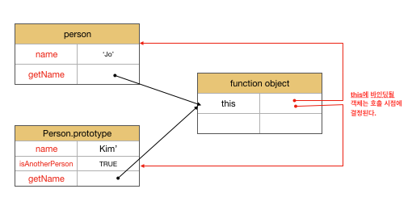

# this

## this Keyword

* this는 `자신이 속한 객체 또는 자신이 생성할 인스턴스를 가리키는 자기 참조 변수`다.
  *  this로 `자신이 속한 객체 또는 생성할 인스턴스의 프로퍼티나 메서드를 참조`할 수 있다.
* `this binding은 호출 방식에 의해 동적으로 결정`된다.

> binding이란? 식별자와 값을 연결하는 과정.

```js
// this는 어디서든 참조 가능하다.
// 전역에서는 window를 가리킨다.
// strict 모드에서는 undefined 이다.
console.log(this); // window

function square(number) {
  // 일반 함수 내부에서 this는 window를 가리킨다.
  console.log(this); // window
  return number * number;
}
square(2);

const person = {
  name: 'Kim',
  getName() {
    // 메서드 내부에서 this는 메서드를 호출한 객체를 가리킨다.
    console.log(this); // { name: 'Kim', getName: [Function: getName] }
    return this.name;
  }
};
console.log(person.getName()); // Kim

function Person(name) {
  console.log(this); // Person {} 아직 할당하기 전이다.
  this.name = name;
  console.log(this); // Person { name: 'Kim' }
}


const ne = new Person('Kim');

```

## 함수 호출 방식과 this 바인딩

* this binding은 함수 호출시 동적으로 결정된다.


Lexical Scope와 this binding은 결정 시기가 다르다.
> Lexical Scope는 `함수 정의가 평가되어 함수 객체가 생성되는 시점에 상위 스코프를 결정`한다.


### 일반 함수 호출

* this에 `전역 객체가 바인딩`된다.
* strict모드에서는 일반 함수 호출시 undefined가 바인딩된다.
* `일반 함수로 호출된 모든 함수(중첩 함수, 콜백 함수) 내부의 this에는 전역 객체가 바인딩`된다.
  * `화살표 함수를 사용`하여 `this binding을 일치`시킬 수도 있다.

> `화살표 함수 내부의 this는 상위 스코프의 this`를 가리킨다.

```js

const obj = {
  value: 100,
  foo() {
    console.log(`foo's this: `, this); // { value: 100, foo: [Function: foo] }
    console.log(`foo's this.value: `, this.value); // 100
    // 메서드내 중첩 함수
    function bar() {
      console.log(`bar's this: `, this); // window
      console.log(`bar's this.value: `, this.value); // undefined
    }
    // 메서드 내에서 정의한 중첩 함수도 일반 함수로 호출시 함수 내부의 this는 전역 객체다.
    bar();
  }
  
}

obj.foo();
```

### 메서드 호출

* 메서드 호출시 이름 앞에 `마침표 연산자앞에 기술한 객체가 바인딩`된다.

```js
const person = {
  name: 'Jo',
  getName() {
    // 메서드 내부의 this는 메서드를 호출한 객체에 바인딩된다.
    console.log('this:', this)
    return this.name;
  }
};

// this: { name: 'Jo', getName: [Function: getName] }
console.log(person.getName()); // Jo

const anotherPerson = {
  name: 'Kim',
  isAnotherPerson: true
};


// getName 메서드를 anotherPerson 객체의 메서드로 할당
anotherPerson.getName = person.getName;

//this: { name: 'Kim', isAnotherPerson: true, getName: [Function: getName] }
console.log(anotherPerson.getName()); // Kim

// getName 메서드를 변수에 할당.
const callGetName = person.getName;

// getName메서드를 일반 함수로 호출
// this: window
console.log(callGetName()); // undefined

```



### 생성자 함수 호출

* 생성자 함수 `내부의 this에는 생성자 함수가 생성할 인스턴스가 바인딩`된다.
* `new 연산자로 호출하지 않으면 일반 함수 호출`로 사용된다.

```js
function Circle(radius) {
  // 생성자 함수 내부의 this에는 생성자 함수가 생성할 인스턴스가 바인딩된다.
  this.radius = radius;
  this.getDiameter = function () {
    return 2 * this.radius;
  };
}

const circle1 = new Circle(5);
const circle2 = new Circle(10);

console.log(circle1.getDiameter()); // 10
console.log(circle2.getDiameter()); // 20

// new 연산자를 호출하지 않으면 일반 함수의 호출이다.
const circle3 = Circle(15);

console.log(circle3); // undefined
console.log(radius); // 15 일반 함수 호출로 인하여 내부의 this는 전역객체를 가리킨다.
console.log(circle3.getDiameter()); // TypeError: Cannot read property 'getDiameter' of undefined
```


### apply/call/bind 메서드에 의한 간접 호출

* `apply/call 메서드의 본질적인 기능은 함수를 호출`하는 것이다.
  * apply는 배열로, call은 리스트로 전달한다.
* bind 메서드는 함수를 호출하지 않고 `this로 사용할 객체만 전달`한다.

```js
function getThisBinding() {
  console.log(arguments);
  return this;
}

// this로 사용할 객체
const thisArg = { a: 1 };

// getThisBinding 함수를 호출하면서 인수로 전달한 객체를 getThisBinding 함수의 this에 바인딩한다.
// apply 메서드는 호출할 함수의 인수를 배열로 묶어 전달한다.
console.log(getThisBinding.apply(thisArg, [1, 2, 3]));
// [Arguments] { '0': 1, '1': 2, '2': 3 }
// { a: 1 }


// call 메서드는 호출할 함수의 인수를 리스트 형식으로 전달한다.
console.log(getThisBinding.call(thisArg, 1,2,3,4));
// [Arguments] { '0': 1, '1': 2, '2': 3, '3': 4 }
// { a: 1 }
```

유사 배열 객체에 배열 메서드를 사용하는 경우에 call, apply를 사용한다.

```js
function convertArgsToArray() {
  console.log(arguments); // [Arguments] { '0': 1, '1': 2, '2': 3, '3': 4 }

  const callArr = Array.prototype.slice.call(arguments);
  const applyArr = Array.prototype.slice.apply(arguments);
  console.log(callArr); // [ 1, 2, 3, 4 ]
  console.log(applyArr); // [ 1, 2, 3, 4 ]
  return [callArr, applyArr];
}

console.log(convertArgsToArray(1, 2, 3, 4)) // [[ 1, 2, 3, 4 ], [ 1, 2, 3, 4 ]]
```

bind 메서드는 메서드 내부의 중첩 함수 또는 콜백 함수의 this 불일치를 해결하기 위해 사용된다.

```js
const person = {
  name: 'Kim',
  foo(callback) {
    // 1번
    setTimeout(callback, 100);
  }
};

person.foo(function () {
  console.log(`Hi! my name is ${this.name}.`); //2번   Hi! my name is undefined.
  // 콜백함수가 일반함수 호출이라 this가 전역객체에 바인딩되어서 this.name이 undefined가 나온다.
});

```

1번의 시점에서는 person 객체를 가리킨다. 하지만 2번 시점에서는 `person.foo의 콜백 함수가 일반 함수로서 호출되어 this가 전역 객체를 가리킨다`.  
아래의 방법처럼 callback함수에 this를 bind 해주면 해결된다.

```js
const person = {
  name: 'Kim',
  foo(callback) {
    // bind 메서드로 callback 함수 내부의 this 바인딩을 전달.
    setTimeout(callback.bind(this), 100);
  }
};

person.foo(function () {
  console.log(`Hi! my name is ${this.name}.`); //Hi! my name is Kim.
});

```

|함수 호출 방식|this binding|
|:---:|:---:|
|일반 함수 호출| 전역 객체|
|메서드 호출| 메서드를 호출한 객체|
|생성자 함수 호출| 생성자 함수가 생성할 인스턴스|
|apply/call/bind 간접 호출| 메서드에 첫번째 인수로 전달한 객체|


