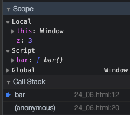
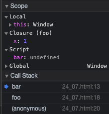
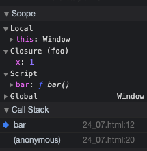

# 클로저

* 함수를 일급 객체로 취급하는 함수형 프로그래밍 언어에서 사용되는 중요한 특성이다.

> 클로저는 `함수와 그 함수가 선언된 Lexical Environment과의 조합`이다.

```js
const x = 1;

function outerFunc() {
  const x = 10;

  function innerFunc() {
    console.log(x); // 10
  }

  innerFunc();
}

outerFunc(); 
```

innerFunc 자체에서 x를 선언한 적이 없지만 `스코프 체인을 통하여 outerFunc의 x값에 접근`하여 가져온다.  
만약 innerFunc이 outerFunc내부에 선언되지 않았다면 가져오지 못한다.  

아래의 예제에서 보면 outerFunc내부에서 똑같이 innerFunc을 호출하지만 outerFunc 내부에서 innerFunc이 선언되지 않았으므로 innerFunc이 선언된 global에서 x를 가져와서 보여준다.  


```js
const x = 1;

function outerFunc() {
  const x = 10;
  innerFunc();
}

function innerFunc() {
  console.log(x); // 1
}

outerFunc();
```


## Lexical Scope

* `자바스크립트 엔진은 함수를 어디에 정의`했는지에 따라 `상위 스코프(Outer Lexical Environment)를 결정`한다.
* `함수가 평가될때 [[Environment]]에 어디서 정의했는지 저장`된다.

## 함수 객체의 내부 슬롯 [[Environment]]

* 함수는 자신의 내부 슬롯 [[Environment]]에 자신이 정의된 환경을 저장한다.
  * `자신이 정의된 환경은 현재 실행 중인 Excution Context의 Lexical Environment`를 가리킨다.


## 클로저와 Lexical Environment 

```js
const x = 1;

function outer() {
  const x = 10;

  const inner = function () { console.log(x); }

  return inner;
}

const innerFunc = outer(); // 3번

innerFunc(); // 10 // 4번
```

3번에서 outer 함수를 호출하고 inner 반환 후 outer 함수는 Execution Context Stack에서 제거된다.  
이때 outer 함수의 지역 변수 x 또한 생명 주기를 마감한다. 하지만 4번에서 innerFunc 호출시 10이 나타난다.  

이처럼 `외부 함수보다 중첩 함수가 더 오래 유지되는 경우 중첩 함수는 이미 생명 주기가 종료한 외부 함수의 변수를 참조`할 수 있다.
이러한 `중첩 함수를 클로저`라고부른다.

* `inner 함수는 자신이 평가될 때 outer 함수를 [[Environment]]에 저장`한다.
* 3번에서 호출 후 outer 함수는 Execution Context Stack에서는 제거되지만 `Outer 함수의 Lexical Environment는 남아있다`.
  * inner 함수에서 outer 함수의 x를 참조하고 있어서 가비지 컬렉션의 대상이 되지 않는다.


```html
<!DOCTYPE html>
<html>
  <body>
    <script>
      function foo() {
        const x = 1;
        const y = 2;

        // 일반적으로 클로저라고 하지 않는다.
        function bar() {
          const z = 3;
          debugger;
          // 상위 스코프의 식별자를 참조하지 않는다.
          console.log(z);
        }

        return bar;
      }
      const bar = foo();
      bar();
    </script>
  </body>
</html>
```

상위 스코프의 식별자를 참조하지 않았으므로 closure가 아니다.



```html
<!DOCTYPE html>
<html>
  <body>
    <script>
      function foo() {
        const x = 1;
        const y = 2;

        // bar 함수는 클로저였지만 곧바로 소멸한다.
        // 이러한 함수는 일반적으로 클로저라고 하지 않는다.
        function bar() {
          
          debugger;
          // 상위 스코프의 식별자를 참조한다.
          console.log(x);
        }

        bar();
      }
      foo();
    </script>
  </body>
</html>
```

상위 스코프의 식별자를 참조하지만 외부 함수 foo보다 중첩 함수 bar의 생명 주기가 짧다.  
중첩 함수 bar는 클로저였지만 외부 함수보다 일찍 소멸되기 때문에 `생명 주기가 종료된 외부 함수의 식별자를 참조할 수 있다는 클로저의 본질에 부합하지 않는다`.  




```html
<!DOCTYPE html>
<html>
  <body>
    <script>
      function foo() {
        const x = 1;
        const y = 2;

        // 클로저
        // 중첩 함수 bar는 외부 함수보다 더 오래 유지되며 상위 스코프의 식별자를 참조한다.
        function bar() {
          
          debugger;
          // 상위 스코프의 식별자를 참조한다.
          console.log(x);
        }

        return bar;
      }
      const bar = foo();
      bar();
    </script>
  </body>
</html>
```

`클로저는 중첩 함수가 상위 스코프의 식별자를 참조하고 중첩 함수가 외부 함수보다 더 오래 유지되는 경우에 한정하는 것이 일반적이다.`



## 클로저의 활용
* `상태를 안전하게 변경`하고 `유지`하기 위해 사용한다.
  * `상태를 은닉하고 특정 함수에게만 상태 변경을 허용`하기 위해 사용한다.

### 클로저를 이용한 카운트 증가 함수.

```js
const increase = (function () {
  // 카운트 상태 변수
  let num = 0;

  // 클로저
  return function() {
    // 카운트 상태 변경.
    // 중첩함수에서 외부함수의 변수를 참조.
    // 중첩함수가 외부함수보다 오래 유지됨.
    return ++num;
  }
})();

console.log(increase()); // 1
console.log(increase()); // 2
console.log(increase()); // 3
```

즉시 실행 함수는 호출된 이후 소멸되지만 즉시 실행 함수가 반환한 클로저는 increase 변수에 할당되어 호출된다.

> 즉시 실행 함수는 한 번만 호출되기에 num 변수가 재차 초기화될 일은 없다.

### 클로저를 이용한 카운트 감소 함수.

```js
const counter = (function () {
  let num = 0;

  return {
    increase() {
      return ++num;
    },
    decrease() {
      return num > 0 ? --num : 0;
    }
  }
})();

console.log(counter.increase()); // 1
console.log(counter.increase()); // 2
console.log(counter.increase()); // 3

console.log(counter.decrease()); // 2
console.log(counter.decrease()); // 1
console.log(counter.decrease()); // 0
```

위의 함수를 생성자 함수로 표현해보자.

```js
const Counter = (function () {
  let num = 0;
  function Counter() {
    // 프로퍼티는 public하므로 은닉되지 않는다.
  }

  Counter.prototype.increase = function () {
    return ++num;
  };

  Counter.prototype.decrease = function () {
    return num > 0 ? --num : 0;
  };

  return Counter;
})();

const counter = new Counter();

console.log(counter.increase()); // 1
console.log(counter.increase()); // 2
console.log(counter.increase()); // 3

console.log(counter.decrease()); // 2
console.log(counter.decrease()); // 1
console.log(counter.decrease()); // 0
```

### 함수형 프로그래밍에서 클로저 활용 예제

```js
// 함수를 인수로 전달받고 함수를 반환하는 고차 함수
// 이 함수는 카운트 상태를 유지하기 위한 자유 변수 counter를 기억하는 클로저를 반환한다.

function makeCounter(predicate) {
  let counter = 0;

  // 클로저를 반환
  return function () {
    // 인수로 전달받은 보조 함수에 상태 변경을 위임.
    counter = predicate(counter)
    return counter;
  }
}

// 보조함수

function increase(n) {
  return ++n;
}

function decrease(n) {
  return --n;
}

// 함수로 함수를 생성한다.
// makeCounter 함순는 보주 함수를 인수로 전달받아 함수를 반환한다.
const increaser = makeCounter(increase); // 1번
console.log(increaser()); // 1
console.log(increaser()); // 2

// increaser 함수와는 별개의 독립된 Lexical Environment을 갖기 때문에 카운터 상태가 연동하지 않는다.
const decreaser = makeCounter(decrease); // 2번
console.log(decreaser()); // -1
console.log(decreaser()); // -2
```

`makeCounter 함수를 호출해 함수를 반환할 때 반환된 함수는 자신만의 독립된 Lexical Environment를 갖는다.`

1번에서 makeCounter 호출하여 Excution Context 생성 후 함수 객체를 생성하여 반환후 소멸.
makeCounter 함수가 반환한 함수는 makerCounter 함수의 Lexical Environment을 상위 스코프로서 기억하는 클로저이며 전역 변수인 increaser에 할당된다.

위의 코드는 카운터의 증감이 연동되지 않는다. 아래는 연동되는 코드이다.


```js
const counter = (function () {
  let num = 0;

  return function (predicate) {

    num = predicate(num);
    return num;
  }
})();

// 보조함수
function increase(n) {
  return ++n;
}

function decrease(n) {
  return --n;
}


console.log(counter(increase)); // 1
console.log(counter(increase)); // 2

console.log(counter(decrease)); // 1
console.log(counter(decrease)); // 0
```
